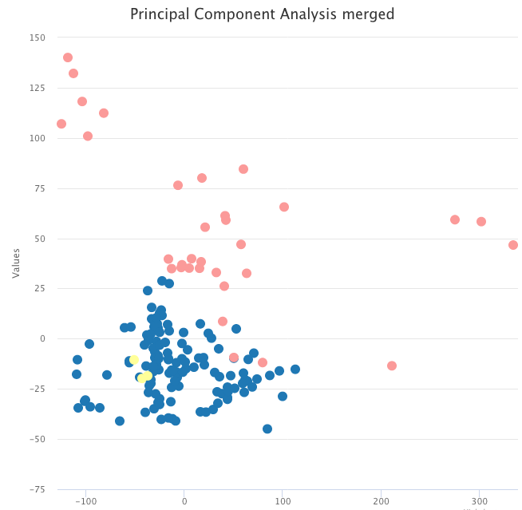

.. pyComBat documentation master file, created by
   sphinx-quickstart on Wed Feb 19 17:44:47 2020.
   You can adapt this file completely to your liking, but it should at least
   contain the root `toctree` directive.

Welcome to pyComBat's documentation!
====================================

General Overview
----------------

Variability in datasets are not only the product of biological processes: they are also the product of technical biases (Lander et al, 1999).
ComBat is one of the most widely used tool for correcting those technical biases called batch effects.

pyComBat (Behdenna et al, 2020) is a new Python implementation of ComBat (Johnson et al, 2007), a software widely used for the adjustment of batch effects in microarray data.
While the mathematical framework is strictly the same, pyComBat:

    1. has similar results in terms of batch effects correction;

    2. is as fast or faster than the R implementation of ComBat and;

    3. offers new tools for the community to participate in its development.

Implementation
--------------
pyComBat is an open source program written in Python language version 3.7.3. It can be run as a command line or a Python library. It is available at https://github.com/epigenelabs/pyComBat.

License
-------

pyComBat is implemented in the Python language and is available under `GPL-3.0 <https://www.gnu.org/licenses/gpl-3.0.en.html>`_ license.

You can find more detailed information in the LICENSE file.

Installing pyComBat
-------------------

pyComBat is usable as a Python package, which is installed with:

.. code-block:: Python

    pip install combat

To upgrade the package to the latest version, please use:

.. code-block:: Python

    pip install combat --upgrade

Then, you can import the pycombat function:

.. code-block:: Python

    from combat.pycombat import pycombat

Using pyComBat
==============

Minimal usage example
---------------------

This minimal usage example illustrates how to use pyComBat in a default setting, and shows some results on ovarian cancer data, freely available on NCBI's `Gene Expression Omnibus <https://www.ncbi.nlm.nih.gov/geo/>`_, namely:

    * GSE18520
    * GSE66957
    * GSE69428

The corresponding expression files are available on `GitHub <https://github.com/epigenelabs/pyComBat/tree/master/data>`_.

.. code-block:: Python

    # import libraries
    from combat.pycombat import pycombat
    import pandas as pd
    import matplotlib.pyplot as plt

    # prepare data
    # the datasets are dataframes where:
        # the indexes correspond to the gene names
        # the column names correspond to the sample names
    # Any number (>=2) of datasets can be treated
    dataset_1 = pd.read_pickle("data/GSE18520.pickle") # datasets can also be stored in csv, tsv, etc files
    dataset_2 = pd.read_pickle("data/GSE66957.pickle")
    dataset_3 = pd.read_pickle("data/GSE69428.pickle")

    # we merge all the datasets into one, by keeping the common genes only
    df_expression = pd.concat([dataset_1,dataset_2,dataset_3],join="inner",axis=1)

    # plot raw data
    plt.boxplot(df_expression.transpose())
    plt.show()

.. figure:: distrib_raw.png
  :width: 600
  :alt: Distribution of raw data

  Gene expression by sample in the raw data (colored by dataset).

.. code-block:: Python

    # we generate the list of batches
    batch = []
    datasets = [dataset_1,dataset_2,dataset_3]
    for j in range(len(datasets)):    
        batch.extend([j for _ in range(len(datasets[j].columns))])

    # run pyComBat
    df_corrected = pycombat(df_expression,batch)

    # visualise results
    plt.boxplot(df_corrected.transpose())
    plt.show()

.. figure:: distrib_corrected.png
  :width: 600
  :alt: Distribution of corrected data

  Gene expression by sample in the batch-effects-corrected data (colored by dataset).

Biological Insight
------------------

The data we used for the usage example contain tumor samples and normal samples. A simple PCA on the raw expression data shows that, instead of grouping by sample type, the data are clustered by dataset.

.. figure:: pca_raw.png
    :width: 600
    :alt: PCA for raw data

    PCA on the raw expression data, colored by tumor sample (blue and yellow) and normal sample (pink).

However, after correcting for batch effects with pyComBat, the same PCA now shows two clusters, respectively with tumor and normal samples. 

    PCA on the batch-effects-corrected expression data, colored by tumor sample (blue and yellow) and normal sample (pink).

Documentation for the code
==========================
.. toctree::
   :maxdepth: 2
   :caption: Contents:

pyComBat utils
--------------
.. automodule:: pycombat
    :members: pycombat

Contributing to pyComBat
========================

Contribution guidelines
-----------------------

Contribution guidelines can be found in `CONTRIBUTING.md <https://github.com/epigenelabs/pyComBat/blob/master/CONTRIBUTING.md>`_.

Unit Testing
------------

Most of the subfunctions can be tested separately. 
The "unit_test" script implements all of them, and can be used to check the good functioning of the whole pyComBat software.

Authors
=======
Contact
-------
To  ask  a  question  on  pyComBat,  report  a  suggestion  (e.g.   why  not  including  other options) or if you think you have discovered a bug (if any?), please contact:

Abdelkader Behdenna at abdelkader@epigenelabs.com

Citing pyComBat
---------------
A. Behdenna, J. Haziza, C.-A. Azencott and A. Nordor. 2020. pyComBat, a Python tool for batch effects correction in high-throughput molecular data using empirical Bayes methods. bioRxiv doi: 10.1101/2020.03.17.995431

Indices and tables
------------------

* :ref:`genindex`
* :ref:`modindex`
* :ref:`search`